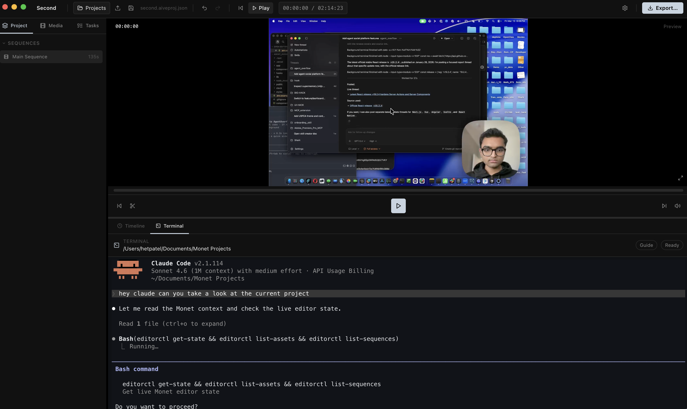
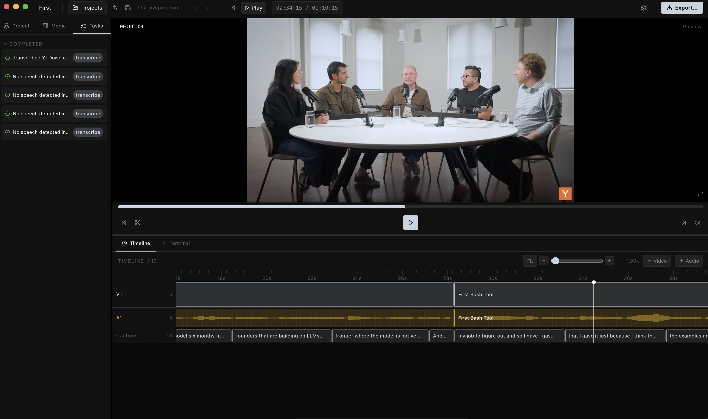

<h1 align="center">Monet</h1>
<p align="center">AI video editor for coding agents</p>

<p align="center">
  
</p>

<p align="center">
  Local-first editing, terminal-native agent workflows, real timeline operations, local transcription, and export in one macOS app.
</p>

<p align="center">
  Built by Het Patel
</p>

<p align="center">
  <a href="https://github.com/Monet-AI-Editor/Monet/releases/latest/download/Monet-macOS-arm64.dmg">
    
  </a>
</p>


## What Monet Is

Monet is a desktop video editor designed for people who want coding agents to work on video directly, not through a fragile bridge into another editor.

The app combines:

- a real timeline and preview
- local project files with autosave and recovery
- an embedded PTY terminal for Claude Code, Codex, and other terminal agents
- deterministic editor tools through `editorctl`, a local API bridge, and MCP
- local transcription with `faster-whisper`
- semantic search powered by embeddings when an OpenAI key is configured
- the same OpenAI key can also be reused for GPT Image 2 generation

Monet is not a chat demo wrapped around a timeline. The terminal, project graph, and editor runtime are the product.

## Features

<table>
<tr>
<td width="42%" valign="top">
<h3>Agent-native terminal</h3>
Claude Code and Codex can run inside Monet's built-in terminal with project-aware context, live editor access, and deterministic commands through <code>editorctl</code>.
</td>
<td width="58%">

</td>
</tr>
<tr>
<td width="42%" valign="top">
<h3>Real timeline editing</h3>
Import media, scrub, trim, split, move, duplicate, ripple edit, generate captions, add markers, and export from a real multi-track timeline.
</td>
<td width="58%">

</td>
</tr>
</table>

- **Terminal-first AI workflow** — Use Claude Code or Codex directly in the app instead of relying on a built-in chatbot abstraction
- **Deterministic editing tools** — `editorctl`, local API bridge, and MCP entrypoint for inspect/edit/export operations
- **Local transcription** — Uses `faster-whisper` on-device by default, with OpenAI fallback when configured
- **Semantic search** — Search spoken content, metadata, and embedded project context
- **Autosave and recovery** — Reopen current work, recover sessions, and manage multiple saved projects
- **Export pipeline** — 720p, 1080p, and 4K outputs, export progress UI, and one-click `Show in Finder`
- **Basic motion and compositing** — transforms, opacity, text overlays, chroma key, and layered export baking
- **Privacy-aware telemetry** — Anonymous usage analytics are optional; Sentry handles crash reporting

## Why Monet

Most AI video workflows today still depend on a human driving Premiere, Resolve, or another editor by hand. Even when tools exist, they usually stop at prompts, scripts, or rough cuts.

Monet is built around a different model:

- the project is a structured graph, not an opaque binary
- the terminal is a first-class editing surface
- agents can inspect the live editor state, import media, search transcripts, cut sequences, and export results

The goal is simple: make video editing something coding agents can actually operate.

## Install

### macOS app

Monet is currently macOS-first.

<a href="https://github.com/Monet-AI-Editor/Monet/releases/latest/download/Monet-macOS-arm64.dmg">
  
</a>

Open the `.dmg` and drag `Monet.app` into `Applications`.

### If macOS blocks Monet on first launch

Because Monet is currently distributed outside the Mac App Store and is not notarized, macOS may show a warning like:

- `"Monet" Not Opened`
- `Apple could not verify "Monet" is free of malware`

If that happens:

1. Try to open `Monet.app` once and let macOS block it.
2. Open `System Settings → Privacy & Security`.
3. Scroll down to the security section.
4. Click `Open Anyway` next to Monet.
5. Confirm the launch.

After that, macOS should allow Monet to open normally on that machine.

If you prefer, you can also:

1. Open `Applications`
2. Right-click `Monet.app`
3. Click `Open`
4. Confirm the prompt

That also creates the exception and avoids repeating the warning.

For a local packaged build from source:

```bash
npm install
npm run dist:mac
```

That produces stable release artifact names like:

- `release/Monet-macOS-arm64.dmg`
- `release/Monet-macOS-arm64.zip`
- `release/mac-arm64/Monet.app`

### Run from source

Requirements:

- Node.js 18+
- `ffmpeg` on your system path
- macOS
- optional telemetry env vars via a local `.env`

Optional local transcription runtime:

```bash
npm run setup:local-transcription
```

Start the app:

```bash
npm install
npm run dev
```

If you want Sentry and Aptabase enabled locally or in release builds, set env vars outside git-tracked files:

```bash
cp .env.example .env
```

Available vars:

- `MONET_SENTRY_DSN`
- `MONET_APTABASE_APP_KEY`
- `VITE_MONET_SENTRY_DSN`

For local use, `VITE_MONET_SENTRY_DSN` can usually match `MONET_SENTRY_DSN`.

## First Run

On first launch, Monet asks for:

- an OpenAI API key for embeddings and semantic search, with the same key reusable for GPT Image 2 generation
- an explicit anonymous usage analytics choice
- nothing else up front

Claude Code and Codex installation help is shown next to the terminal when needed, instead of blocking onboarding.

## What Agents Can Do

Through the embedded terminal, `editorctl`, API bridge, and MCP surfaces, agents can:

- inspect the current project and active sequence
- list assets, tracks, clips, markers, and segments
- import media from disk
- split, trim, move, duplicate, rename, and remove clips
- add tracks and transitions
- generate captions from transcript segments
- create rough cuts and selects from search results
- extract frames and create contact sheets
- run transcription
- export the active sequence

Example:

```bash
editorctl get-state
editorctl list-assets
editorctl search-segments "terminal workflow"
editorctl export /tmp/monet-export.mp4 high 1080p mp4
```

## Local AI Stack

Monet is intentionally local-first.

- **Transcription**: local `faster-whisper` by default
- **Embeddings**: OpenAI API key required
- **GPT Image 2 generation**: the same OpenAI API key can be reused
- **Export**: local `ffmpeg`
- **Project files**: plain `.aiveproj.json` files plus autosaves

If embeddings or transcripts do not exist yet, Monet should say that directly instead of pretending otherwise.

## Project Model

Monet projects are structured, inspectable, and tool-friendly.

That includes:

- assets
- sequences
- tracks
- clips
- transcript segments
- markers
- captions
- effects
- exports

This is what allows coding agents to operate the editor directly instead of scraping the UI.

## Current Scope

Monet already supports:

- timeline editing
- preview and scrubbing
- autosave / recover
- local transcription
- semantic search foundations
- captions and markers
- terminal-native agent workflows
- packaged macOS app builds

Monet is still evolving in areas like:

- richer color finishing
- deeper motion tooling
- broader codec coverage
- more advanced compositing
- wider platform support beyond macOS

## Privacy

Monet does not collect project content for analytics.

That means:

- no filenames
- no prompts
- no transcript text
- no media content
- no API keys

Anonymous usage analytics are optional. Crash reporting is handled separately.

Telemetry keys are injected from environment variables at build time and are not stored in the repository.

## Build

```bash
npm run build
```

Other useful scripts:

```bash
npm run dev
npm run typecheck
npm run build:cli
npm run build:mcp
npm run dist:mac
```

## Repository Layout

- `src/main` — Electron main process, project store, export, transcription, terminal, updater, analytics
- `src/renderer` — React app UI
- `src/cli` — `editorctl`
- `src/mcp-server` — MCP server entrypoint
- `resources` — screenshots and app icon assets
- `release` — packaged macOS artifacts

## Status

Monet is already usable as a real macOS app, but it is still best described as an early public alpha rather than a finished mass-market editor.

If you want to help shape it:

- open issues
- test the app on real media
- try the terminal agent workflow
- report reliability problems before polish problems

## License

Monet is released under the MIT License.
